# P4-viewDB-showTVTime

Codi base de la pràctica 4 de DS 2024-25: GUI i BD de ShowTVTime

Grau d'Enginyeria Informàtica. Facultat de Matemàtiques i Informàtica. UB


<!-- TOC start (generated with https://github.com/derlin/bitdowntoc) -->

- [1. Descripció ](#1-descripció)
- [2. Instal·lació<a name="installació"></a>](#2-installació)
- [Apèndix A: Part de la Vista gràfica: GUI](#apèndix-a-part-de-la-vista-gràfica-gui)
- [Apèndix B: Manual de la Base de Dades](#apèndix-b-manual-de-la-base-de-dades)
- [Apèndix C: Problemes d'instal·lació: Que fer perquè el projecte funcioni?](#apèndix-c-problemes-dinstallació-que-fer-perquè-el-projecte-funcioni)

<!-- TOC end -->

## 1. Descripció 

Per tal que pugueu dissenyar més ràpidament la pràctica 4, us proporcionem ja una interfície gràfica implementada en Java FX, que podeu modificar al vostre gust. Podeu també fer-la des de zero si aquesta interfície no us convenç, però recordeu que la finalitat de la pràctica 4 és **estudiar el disseny intern del software i no estudiar la interfície gràfica per si mateixa.**

## 2. Instal·lació


**PAS 1.** Configura el projecte per a que s'executi la interfície gràfica

Vigila que la versió de Java ara ha de ser la **17**, per a poder compilar amb JavaFX.

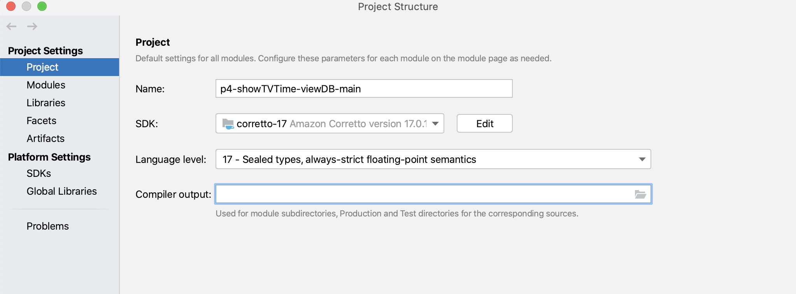

**PAS 2.** Instal·la les dependències i marcala carpeta de src con la de *sources root*

Per a instal·lar les dependències del projecte el primer cop que l'executes, fes clic amb el botó dret del ratolí sobre el arxiu pom.xml, obre el menú Maven, i selecciona la opció de recarregar projecte.

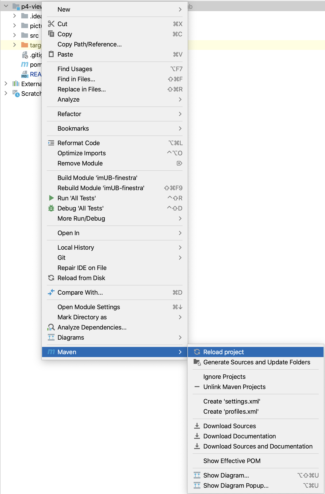

No oblidis de marcar la carpeta de src: 

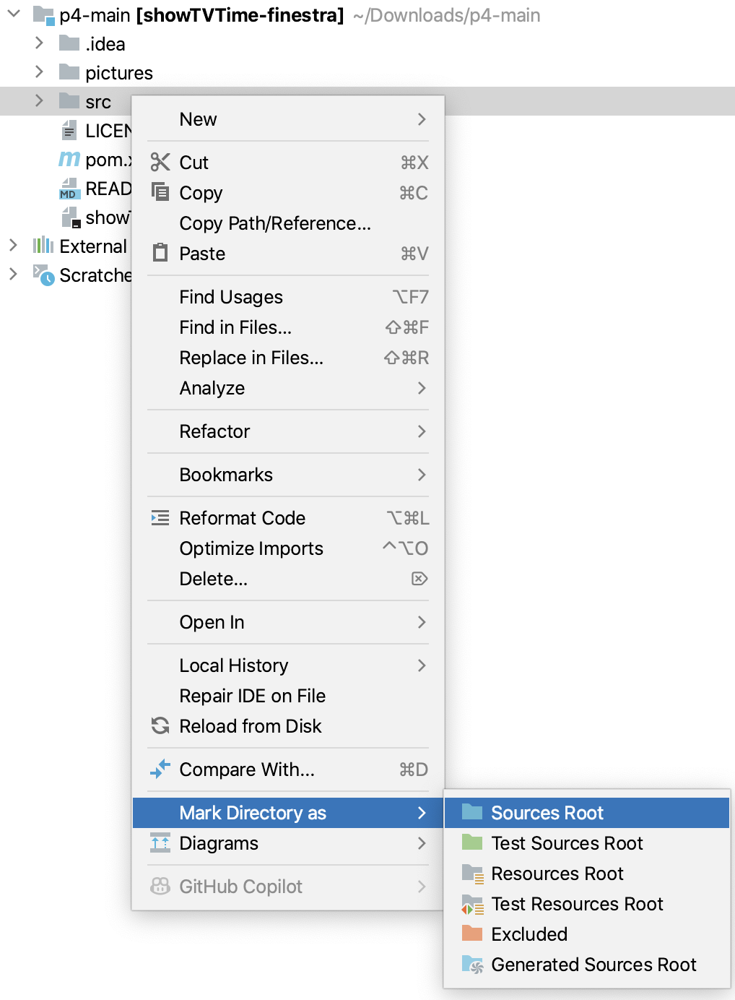

**PAS 3.** Configura IntelliJ per a accedir a la Base de Dades

Funciona només en la versió Ultimate de la que teniu llicència d'estudiant. 
Podeu usar la vista de base dades per comprovar-ne i editar-net el contingut. Mira l'Apèndix B per més detalls.

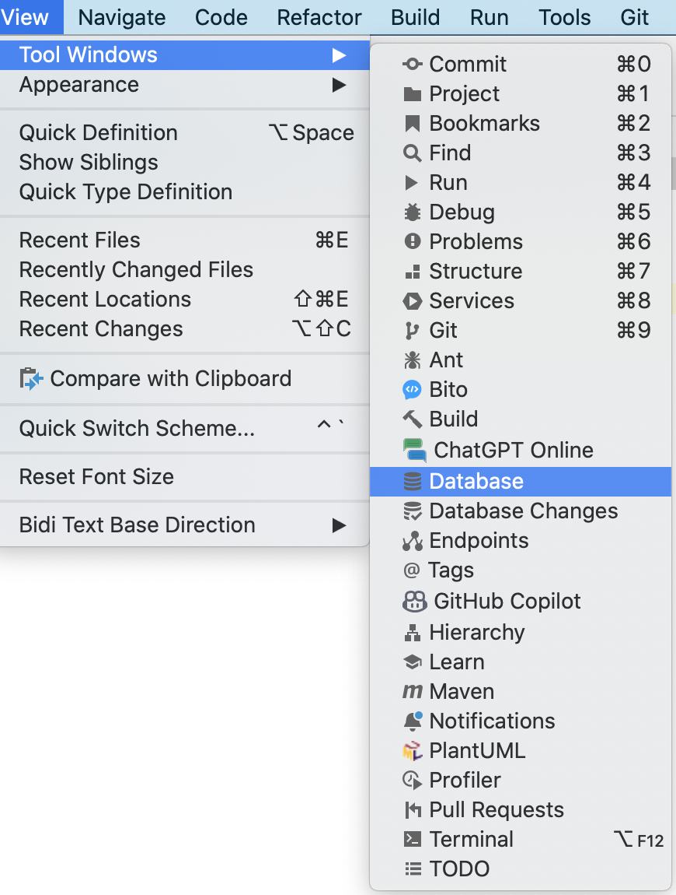

**PAS 4.** Executa el projecte: AppMain

**p4-viewDB-showTVTime** de la pràctica 4 està formada per un projecte que conté una classe main: AppMain que crea directament la vista, sense tenir ni controlador ni model.

Quan executeu el codi, surt una primera finestra per entrar un nom d'una persona enregistrada a l'aplicació (mira la base de dades per veure les persones inscrites a la taula Persona):

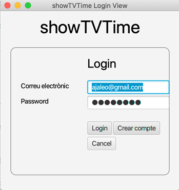

En aquesta versió, podeu entrar amb qualsevol client de la base de dades i la seva contrasenya i us deixarà entrar a l'aplicació general. La finestra principal (formulari **main-view** ) té el següent aspecte:

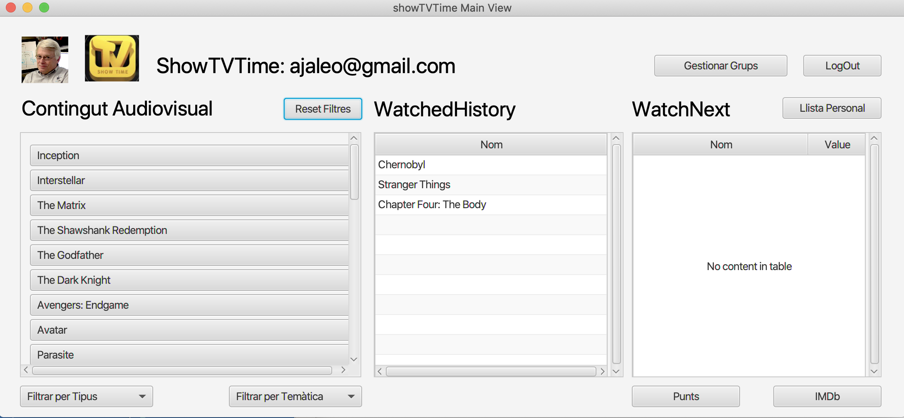

Per ara hem posat dades a les llistes de les pel·lícules i les sèries a la Base de Dades a mode d'exemple de com omplir les llistes de la interfície. 
Fixeu-vos que hi ha llistes que es poden carregar en la vista des de l'inici, i d'altres que cal anar actualitzant a mesura que es modifiquen les Watched History, afegint-lis continguts digitals.

En aquesta finestra ja podeu veure les llistes que us comentava l'enunciat:

1. La Llista dels continguts digitals disponibles que es poden llistar ordenats per nom.
2. La WatchedHistory i la WachtNext de l'suauri que s'ha loguejat.

Fixeu-vos que al peu de les llistes teniu diferents opcions:

- A la llista de Continguts Digitals es poden llistar per tipus (Pel·l´ciules o Sèries) o cercar per Temàtica.
- Les llistes de WatchedHistory i WatchNext poden ser de l'usuari o els top 10 globals de l'aplicació.
Recordeu que en la finestra principal de l'aplicació, la part de les WatchedHitsory i WatchNext  **sempre** estan visibles en la pantalla de l'aplicació, actualitzant-se quan hi hagi canvis en les llistes,
sense necessitat que l'usuari provoqui el refresc, sinó just en el moment que es detecti un canvi en les dades.

Quan selecciones el botó de **GestionarGrups** apareixerà una altra pantalla on es pot gestionar el perfil de l'usuari per poder escollir grups que vol seguir o, dels que segueix, els que vol ser membre. 

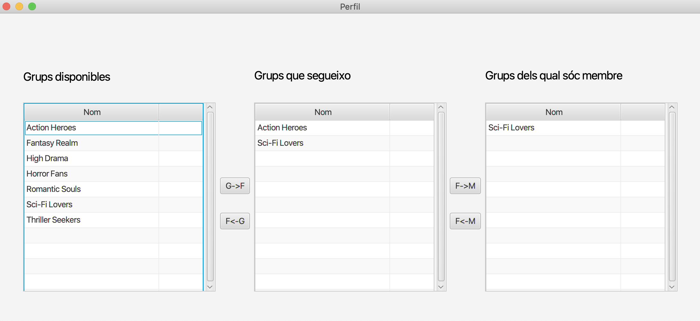


**PAS 5.** Explora el projecte:

Explora les classes que tens a cadascuna de les parts del Model-Vista-Controlador.

El teu main es troba a la classe AppMain que deriva de la classe Application de la llibreria de JavaFX. Explora el main del projecte i distribueix les responsabilitats de crear el Controlador, el Model i la Vista segons convingui. El codi que se't dona és només una versió per a que funcioni. 
En el segon pas de la pràctica 4 proposaràs qui hauria de cridar o crear a qui.

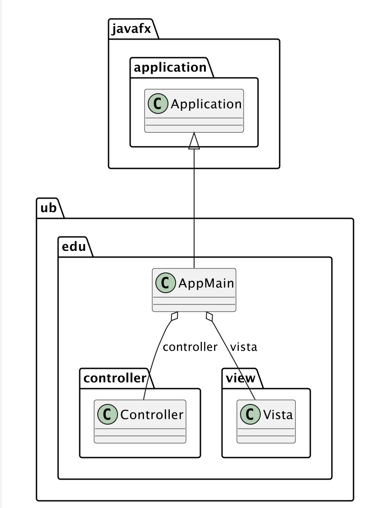

**PAS 5.1.** Explora la part del Model

Fixa't que en el model s'han inclòs classes per a codificar els continguts digitals i les persones, via dues classes showTVTimeCataleg.java i showTVTimePersones.java. També s'ha afegit una façana per a poder desacoblar el controlador del contingut del model (classe ModelFacade).

A la carpeta de resources s'ha afegit una façana per inicialitzar i treballar a la vegada amb els serveis oferts pel DataService i les classes internes del model (classe ResourcesFacade).

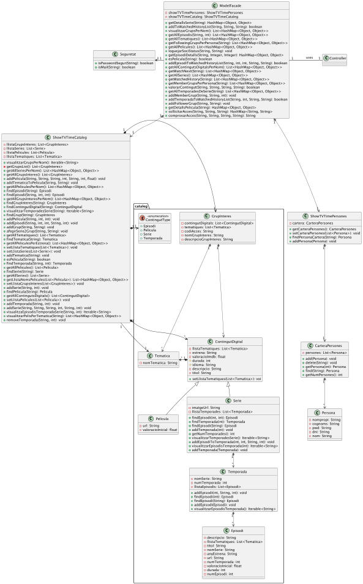

Fixa't com s'organitza la capa de resources de l'aplicació:


**PAS 5.2. Explora la part del Controlador**

El Controlador dona els serveis a la Vista. Té la classe SessionMemory per poder tenir la informació que està activa a cada moment de l'aplicació.

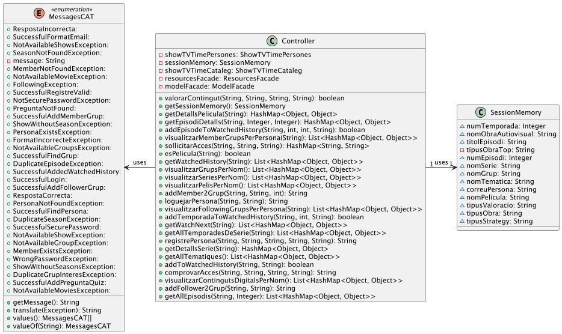

**PAS 5.3.** Explora les classes de la carpeta view per a veure com es programa la interfície gràfica en JavaFX

El paquet de la vista està organitzat segons el següent diagrama de classes. Executa el projecte per veure a partir de quina finestra es creen les finestres que van apareixen a l'execució.

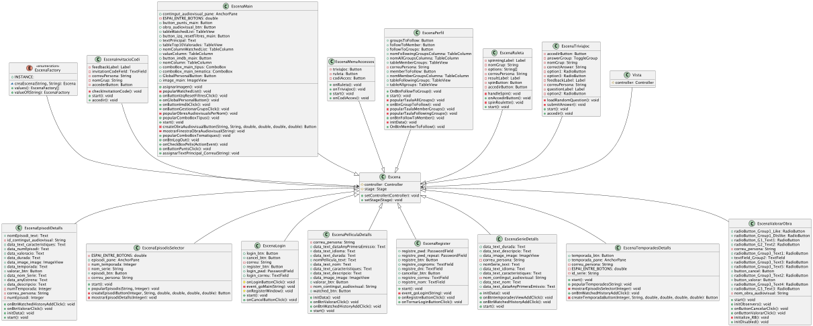

Cada escena té associada un fitxer .fxml on es troba la distribució dels diferents components de l'escena (botons, camps de text, pestanyes...). Aquests fitxers es troben a la carpeta de view-resources/ub/edu/view i es poden editar manualment tal i com es detalla a l'Apèndix A.1. Es pot utilitzar també un _SceneBuilder_ (consultar l'Apèndix A.2). Addicionalment, també es pot incloure un fitxer _.css_ per modificar l'estil dels components de l'escena (no es valorarà en aquesta pràctica).


## Apèndix A: Part de la Vista gràfica: GUI

**A.1. Afegir una nova finestra a l'escena: Cal lligar el .java amb el fxml i a l'inrevés**

Per crear una nova finestra amb una escena, cal:

1. Crear un nou fitxer .fxml associat a aquesta. Per aquest exemple, prenem el fitxer _login-view.fxml_

1. En el fitxer .fxml de cada escena, trobarem un paràmetre, _fx:controller_, on podem indicar quina és la classe associada a aquesta escena. Per exemple, en el fitxer _login-view.fxml_, trobem al final de la línia 13:
```fxml
fx:controller="ub.edu.view.EscenaLogin"
```

1. Utilitzar el mètode _creaEscena_ de _EscenaFactory_, tot indicant per paràmetres el nom del fitxer fxml (sense l'extensió), i el títol que volem que tingui la finestra. Mira per exemple la línia 14 de la classe Vista.java on es crea una finestra per mostrar la finestra de login:

``` 
 Escena login = EscenaFactory.INSTANCE.creaEscena("login-view", "TripUB Login View");

```
Com el mètode _creaEscena_ de _EscenaFactory_ ens retorna la instància de l'Escena que acabem de crear (en aquest exemple, ens retornaria una instància de _EscenaLogin_), ara ja podem cridar a mètodes de l'Escena que acabem d'instanciar (línies 16 i 17 de la classe Vista):

```
 login.setController(controller); 
 ```
 

**A.2. SceneBuilder**

Els SceneBuilders són editors visuals dels fitxers .fxml. Hi ha dos principals que podeu descarregar:

[**https://www.oracle.com/java/technologies/javase/javafxscenebuilder-info.html**](https://www.oracle.com/java/technologies/javase/javafxscenebuilder-info.html)

[**https://gluonhq.com/products/scene-builder/**](https://gluonhq.com/products/scene-builder/)

Si descarregueu el _SceneBuilder_ de _gluonhq_, us proporcionarà alguns components que no s'inclouen a les llibreries del projecte. Aquests components no s'han d'utilitzar (el programa us avisarà abans quan intenteu afegir aquests tipus de components).

Un cop descarregat, podreu modificar els fitxers .fxml fent click dret i seleccionant "Open in SceneBuilder":

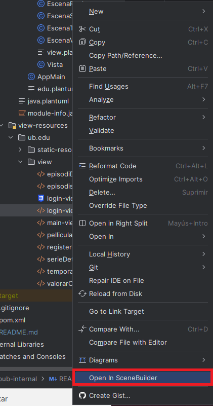

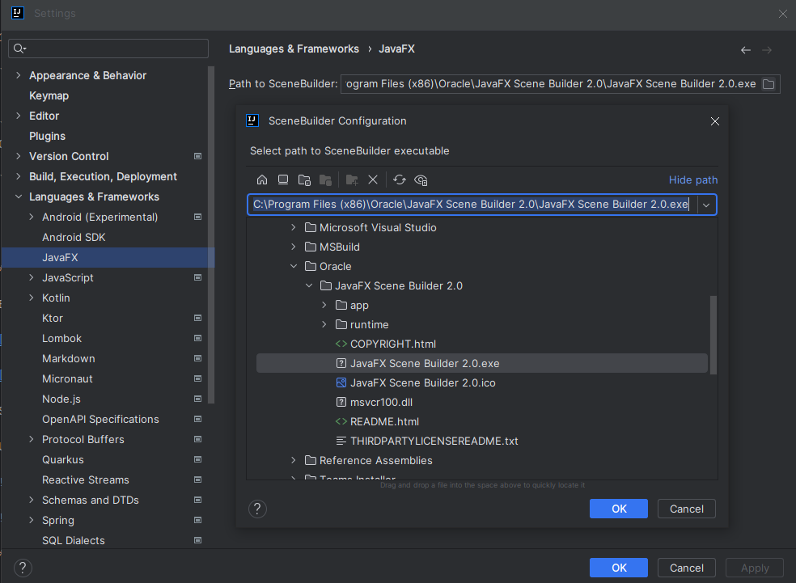

**A.3. Exposant components de la vista des dels fitxers .fxml a les Escenes**

Per poder accedir des del codi als diferents components d'una Escena, un cop tingueu creat el component, haureu d'afegir un paràmetre _fx-id_ indicant el nom de la variable que vulgueu que tingui el component. Per exemple, pel botó de Login en _login-view.fxml, línia 44,trobem:_

```fxml
<Button fx:id="login_btn" layoutX="150.0" layoutY="145.0" onAction="#onLoginButtonClick" styleClass="login_btn" text="Login" />
```

I, en _EscenaLogin.java,_ tenim declarats tots els components que hem exposat en el fitxer _.fxml_:
```java
public class EscenaLogin extends Escena {

    public Button login_btn;
    public TextField login_correu;
    public PasswordField login_pwd;
    public Button register_btn;
    public Button cancel_btn;
    private String correu;
    ...
}
```

Fixem-nos també que, en el fitxer _.fxml_, hem posat la tag _onAction="#onLoginButtonClick"._ Això vol dir que, en fer click en aquest botó, es cridarà al mètode _onLoginButtonClick_ de la classe _EscenaLogin_ (línia 27).
```java
 @FXML
    protected void onLoginButtonClick(){
        String correu=login_correu.getText();
        String pwd=login_pwd.getText();
        ...
  }
```

## Apèndix B: Manual de la Base de Dades

**B.1. Com veure les dades de la Base de Dades des d'IntelliJ**

Activa la visualització de la Base de dades a IntelliJ, anant al menú de View-\>Tool Windows -\> DataBase


Hauràs de veure una llengüeta a la dreta de la interfície del IntelliJ que posa Database.

Si allà no se'n mostra cap, indica on està la Base de Dades, seleccionant DataSource From Path:

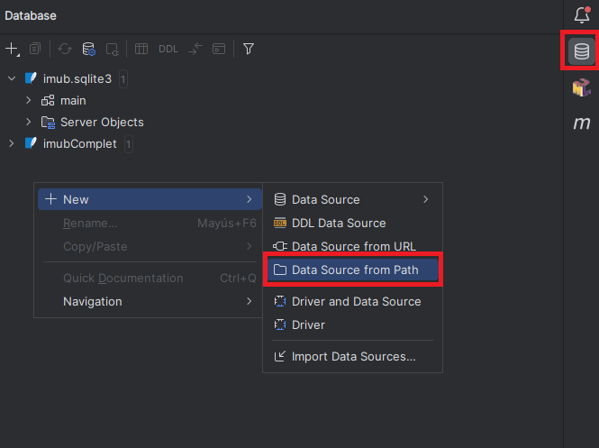


I en el menú, posa on està la nostra base de dades (fitxer data.sqlite dins de la carpeta Data dels DAOs tipus DB):

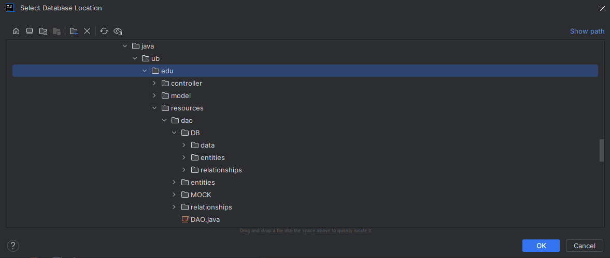

Et sortirà un menú on només cal que acceptis clicant el botó OK:

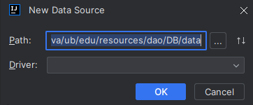

Finalment, et sortirà la Base de Dades a la finestra de la dreta. Si dins del main no hi trobes res, prem el botó de refrescar.

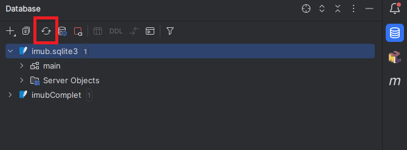

Finalment, selecciona la taula dins de main-\>tables i podràs veure el seu contingut

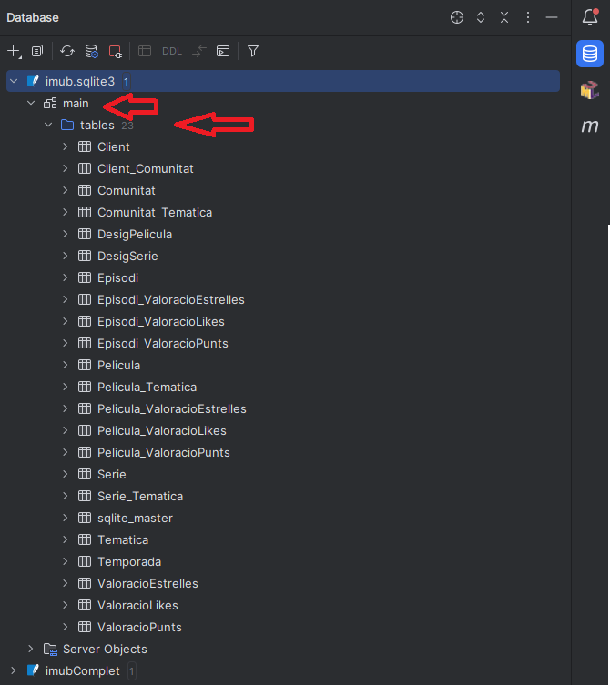

**B.2. Com modificar les dades i reflectir els canvis a showTVTime**

Un cop visualitzis una taula concreta pots posar-hi més valors a les noves files. Per que tot funcioni:

1. Para l'execució del AppMain (si en tens alguna executant-se)
2. Modifica o afegeix les dades que vulguis a la taula que desitgis prement el botó "+"

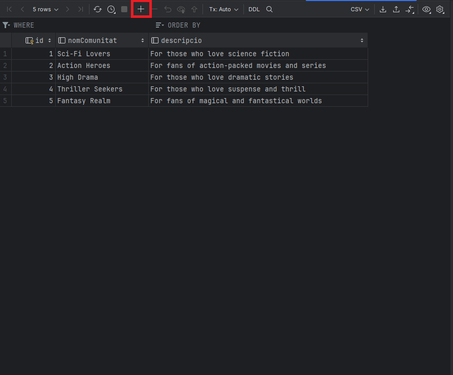

1. Recorda a omplir tots els camps (excepte els que diuen \<generated\> que s'omplen automàticament per la Base de Dades.:


1. Prem el botó de Submit per a actualitzar la BD:

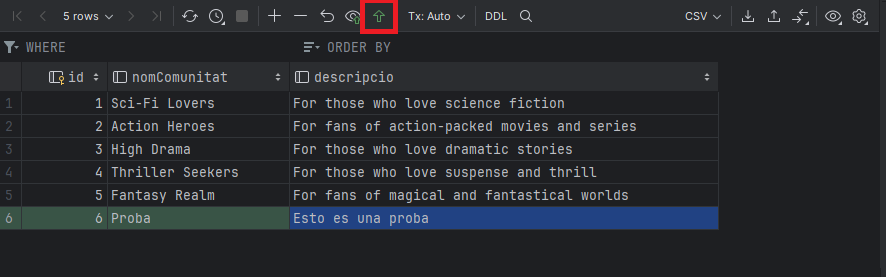

1. Si veus que et surt un missatge com el que segueix, és per què tens una execució del AppMain corrent a la teva màquina. Atura-la i torna a fer el submit.


## Apèndix C: Problemes d'instal·lació: Que fer perquè el projecte funcioni?

De vegades, el problema són les dependències del JavaFX que van lentes amb el Maven o hi ha algun solapament. Però, en principi, cal:

- Primer cal descarregar (o clonar) el projecte del gitHub (o del classroom).
- Després, comprova que l'arxiu pom.xml es reconeix com a arxiu Maven .
- Per últim, amb el botó dret del ratolí, es selecciona Maven i reload project.

Després cal esperar una mica per a que carregui les dependències. Tot i així en obrir el fitxer AppMain poden passar 2 coses:

1. hi ha text o línies en vermell (per la qual cosa hem de tornar a recarregar el pom. És una mica especial de vegades i cal carregar-lo dues vegades.
2. No hi ha res en vermell pel què agafa bé les dependències.

Un cop hem compilat bé, cal executar el AppMain. Aquí pot passar el següent:

1. Aconsegueix arrencar bé i ja funciona i per tant executa la vista. (si s'arriba fins aquí, el tema del pom cal fer-ho la primera vegada que te'l baixes, ara ja sempre et funcionarà si vas fent pulls i pushs en el github).
2. Salta un error que falten o no es troben algunes dependències del FX. És una línia vermella, màxim 3. En aquest cas, el que cal fer és de nou donar-li botó dret al Maven i recarregar les dependències. Dona-li el seu temps perquè les carregui i, en cas que tardi una mica més, és que ara si les està carregant bé.

Si tot ha anat bé, ja pots executar el AppMain i veure la vista. Si no, torna a fer un pull del projecte i torna a començar.
